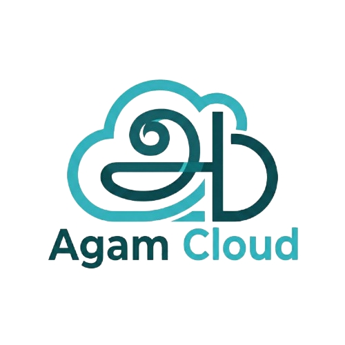

  

---

Agam Cloud is a lightweight, self-hosted cloud platform designed to let you store, access, and manage your data without depending on any external cloud provider. It focuses on privacy, simplicity, and full ownership of your digital life.

**Agam** is a Tamil word meaning “inner self.” The platform embodies this principle by ensuring your files stay entirely within your control. 

Private, secure, and inaccessible to third parties.

Agam Cloud aims to provide the conveniences of major cloud storage services while keeping the architecture minimal, transparent, and easy to run on your own infrastructure.

## Features

- **Self-hosted storage**  
  Your data stays on your servers, systems, or local network.

- **Multi-device access**  
  Sync and access your files across devices without vendor lock-in.

- **Scalable design**  
  Built to function smoothly on small personal setups as well as larger self-hosted environments.

- **Lightweight architecture**  
  Minimal dependencies, clean structure, and efficient resource usage.

## Tech Stack

- **Go** – Backend services and APIs  
- **MinIO** – Object storage layer with S3-compatible interfaces  
- **PostgreSQL** – Reliable relational database for metadata and user management

## Architecture Overview

Agam Cloud uses a simple and modular design:

1. **API Layer (Go)**  
   Handles authentication, file operations, metadata, sync logic, and background tasks.

2. **Object Storage (MinIO)**  
   Stores actual files and media with high performance and S3 compatibility.

3. **Database Layer (PostgreSQL)**  
   Manages user accounts, vaults, file metadata, previews, and sync tracking.

## Current Development Status

Development of the core platform is complete, including:

- User authentication  
- Vault and file management  
- Upload and download flows  
- Thumbnail generation for images  
- Basic mobile and desktop sync logic  
- Preliminary UI flows  

Testing is in progress, with optimizations and refinements underway.

## Future Development 

The mobile frontend and web frontend are to be developed, if you'd like to contribute by doing this, you're more than welcomed!

Will also add a How to use guide soon!

## License

Agam is Licensed under GNU AGPLv3

## Contributing

Contributions of all forms are welcome:

- Reporting issues  
- Suggesting improvements  
- Submitting pull requests  
- Improving documentation  
- Testing features in real-world environments  

If you're interested in helping shape the project, feel free to open an issue or start a conversation.

---

